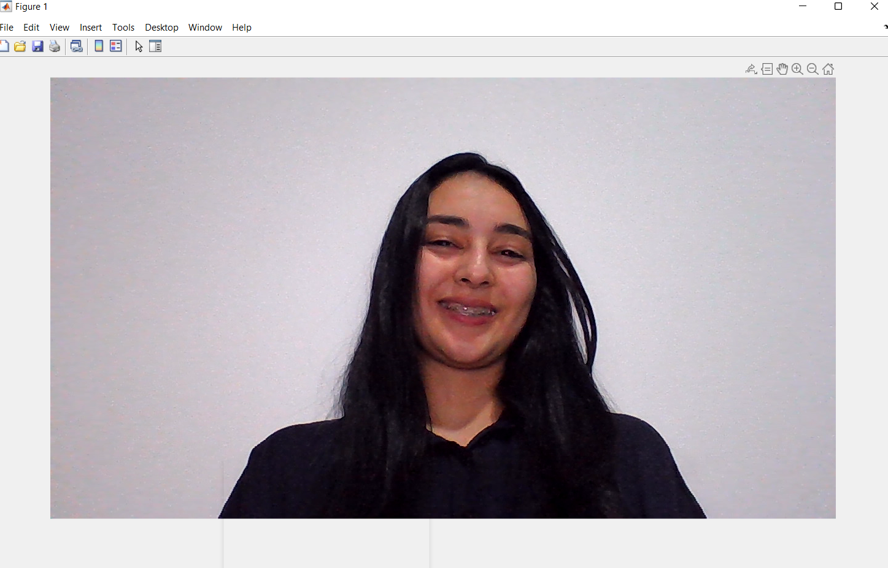
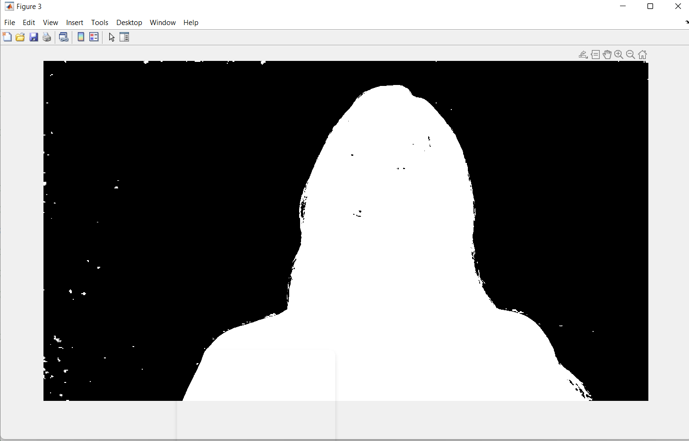
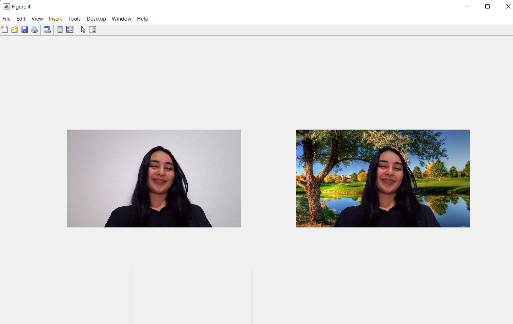
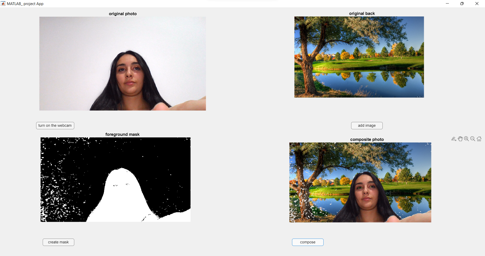

# Change Background: Greenscreen matting without the green screen

- ## [summary](#Summary)
    - ### [INTRODUCTION](#INTRODUCTION)
    - ### [Change Background of an image](# Change Background of an image)
    - ### [Change Background of a video](# Change Background of a video)
    - ### [ Interfaces](# Interfaces)


# INTRODUCTION

Human matting is an extremely interesting task where the goal is to find any human in a picture and remove the background from it. It is really hard to achieve due to the complexity of the task, having to find the person or people with the perfect contour. In this post, I review the best techniques used over the years and a novel approach published on November 29th, 2020. Many techniques are using basic computer vision algorithms to achieve this task, such as the GrabCut algorithm, which is extremely fast, but not very precise. 

# Change Background of an image

### Upload the image


I am going to turning on the webcam and taking one  snapshot of that an then i close my snapshot by using <webcam> and The <snapshot> function opens a camera preview on the device and returns the current frame in MATLAB® as an RGB image. The resolution of the image is specified by the Resolution property of the camera object cam.
  
```matlab
  clc
  clear
  close all 
  warning off 
  ca= webcam; 
  e=ca.snapshot;
  imshow(e);
  ```
  <!-- PROJECT image -->
<br />
<div align="center">
    
  
</div>
  
  
### Upload the new background
I am reading an image that we are going to use to replace our background and that I am also showing.
  
  ```matlab
gk=imread('Nature.JPG'); 
figure; 
imshow(gk); 
   ```
<!-- PROJECT image -->
<br />
<div align="center">
    
  
</div>
  
### create mask on our image
we gonna use imresize that  returns image gm that has the number of rows and columns specified by the two-element vector [r c] , createMask that returns a binary mask image with pixels inside the ‘e’ set to true and pixels outside the ‘e’ set to false and mkdir that when the folder  creates the folder folderName. If folderName exists, MATLAB issues a warning. If the operation is not successful, mkdir throws an error to the Command Window.
 
   ```matlab
 [r, c , b]=size(e);
gm=imresize(gk,[r c]);
mkdir=createMask(e);
figure;
imshow(mkdir);
   ```
   <!-- PROJECT image -->
<br />
<div align="center">
    
  
</div>
  
### changing the background
we gonna select the new background (nature) and remove only the body part and we gonna  use the uint8 which the  Variables in MATLAB of data type (class) uint8 are stored as 1-byte (8-bit) unsigned integers.
  
  
  ```matlab
  gs=gm.*uint8(~mkdir);
figure;
imshow(gs);
subplot(1,2,1);
imshow(e);
subplot(1,2,2);
imshow(gs+e.*uint8(mkdir));
gm=gk;
   ```
 
# RESULT 
we gonna replace our face and our body part on the new image
  
  ```matlab
  clc
clear  
close all
warning off
ca= webcam;
e=ca.snapshot;
imshow(e);
clear ca;
gk=imread('Nature.JPG');
figure;
imshow(gk);
[r, c , b]=size(e);
gm=imresize(gk,[r c]);
mkdir=createMask(e);
figure;
imshow(mkdir);
gs=gm.*uint8(~mkdir);
figure;
imshow(gs);
subplot(1,2,1);
imshow(e);
subplot(1,2,2);
imshow(gs+e.*uint8(mkdir));
gm=gk;


function [BW,maskedRGBImage] = createMask(RGB)
%createMask  Threshold RGB image using auto-generated code from colorThresholder app.
%  [BW,MASKEDRGBIMAGE] = createMask(RGB) thresholds image RGB using
%  auto-generated code from the colorThresholder app. The colorspace and
%  range for each channel of the colorspace were set within the app. The
%  segmentation mask is returned in BW, and a composite of the mask and
%  original RGB images is returned in maskedRGBImage.

% Auto-generated by colorThresholder app on 13-Aug-2020
%------------------------------------------------------


% Convert RGB image to chosen color space
I = rgb2hsv(RGB);

% Define thresholds for channel 1 based on histogram settings
channel1Min = 0.196;
channel1Max = 0.000;

% Define thresholds for channel 2 based on histogram settings
channel2Min = 0.000;
channel2Max = 0.236;

% Define thresholds for channel 3 based on histogram settings
channel3Min = 0.322;
channel3Max = 1.000;

% Create mask based on chosen histogram thresholds
sliderBW = ( (I(:,:,1) >= channel1Min) | (I(:,:,1) <= channel1Max) ) & ...
    (I(:,:,2) >= channel2Min ) & (I(:,:,2) <= channel2Max) & ...
    (I(:,:,3) >= channel3Min ) & (I(:,:,3) <= channel3Max);
BW = sliderBW;

% Invert mask
BW = ~BW;

% Initialize output masked image based on input image.
maskedRGBImage = RGB;

% Set background pixels where BW is false to zero.
maskedRGBImage(repmat(~BW,[1 1 3])) = 0;

end
```
<!-- PROJECT image -->
<br />
<div align="center">
    
  
</div>
  
 # Change Background of a video
  
 im gonna using the same code white loop while that  iteratively executes its child components while a specified condition is true. The While Loop component must have at least one child component; the purpose of this component is to run its children several times. If it does not have any children, this component does not add anything to the report.
  
 
```matlab
clc
clear 
close all
warning off
ca= webcam;

gk=imread('Nature.JPG');
while true
    e=ca.snapshot;
    [r, c, b]=size(e);
    gm=imresize(gk,[r c]);
    mkdir=createMask(e);
    gs=gm.*uint8(~mkdir);
    subplot(1,2,1);
    imshow(e);
    subplot(1,2,2);
    imshow(gs+e.*uint8(mkdir));
    gm=gk;
end


function [BW,maskedRGBImage] = createMask(RGB)
%createMask  Threshold RGB image using auto-generated code from colorThresholder app.
%  [BW,MASKEDRGBIMAGE] = createMask(RGB) thresholds image RGB using
%  auto-generated code from the colorThresholder app. The colorspace and
%  range for each channel of the colorspace were set within the app. The
%  segmentation mask is returned in BW, and a composite of the mask and
%  original RGB images is returned in maskedRGBImage.

% Auto-generated by colorThresholder app on 13-Aug-2020
%------------------------------------------------------


% Convert RGB image to chosen color space
I = rgb2hsv(RGB);

% Define thresholds for channel 1 based on histogram settings
channel1Min = 0.196;
channel1Max = 0.000;

% Define thresholds for channel 2 based on histogram settings
channel2Min = 0.000;
channel2Max = 0.236;

% Define thresholds for channel 3 based on histogram settings
channel3Min = 0.322;
channel3Max = 1.000;

% Create mask based on chosen histogram thresholds
sliderBW = ( (I(:,:,1) >= channel1Min) | (I(:,:,1) <= channel1Max) ) & ...
    (I(:,:,2) >= channel2Min ) & (I(:,:,2) <= channel2Max) & ...
    (I(:,:,3) >= channel3Min ) & (I(:,:,3) <= channel3Max);
BW = sliderBW;

% Invert mask
BW = ~BW;

% Initialize output masked image based on input image.
maskedRGBImage = RGB;

% Set background pixels where BW is false to zero.
maskedRGBImage(repmat(~BW,[1 1 3])) = 0;

end

 ```
  
# Interfaces

<!-- PROJECT image -->
<br />
<div align="center">
    
  
</div>
